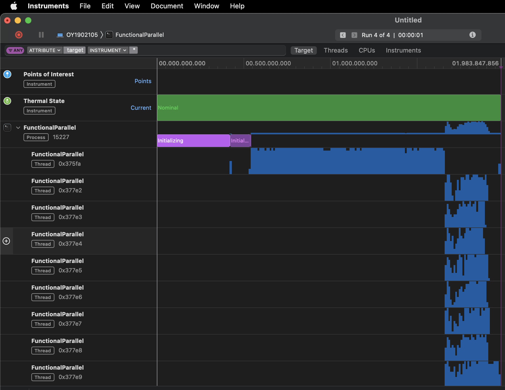

# FunctionalParallel

FunctionalParallel demonstrates one programming style to solve the frequent words task, where an app reads a text file containing a book. App then calculates the most often used words and their frequencies from a text file, ignoring words listed in another file. 

This implementation is, in principle, the same as in Functional demonstration. What is different to Functional is that in this implementation, the word array read from a book file is sliced into eight, and each slice is then processed *in parallel* in separate Swift `async` tasks. This makes the implementation somewhat faster than the Functional implementation. 

Compare the speed advantage in your computer. On a Mac Mini M1 (2020) with macOS Monterey 12.2.1 (21D62) and Apple Swift version 5.5.2, FunctionalParallel took 0.69851 secs to handle the Bulk.txt file (~16MB), as the Functional took 1.1815 secs.

> Note: updated this to Swift 5.6, need to measure and update the above performance numbers soon...

Image below shows the eight threads of processing in Xcode Instruments:



Result could look like this:

```console
Listing 100 most common words.
1. he.................. 32108
2. that................ 27021
3. his................. 20040
4. it.................. 16443
5. for................. 16186
6. with................ 16070
7. was................. 14628
8. not................. 13568
9. han................. 13296
10. him................. 12886
11. hanen............... 12428
...
```

This implementation is demonstrating [functional programming](https://en.wikipedia.org/wiki/Functional_programming) with **parallel threads** as a way to solve the problem, using Swift as the programming language. The code uses the Swift collection methods:

1. `filter` to filter out words to ignore from the array of words read from the file,
1. `reduce` to create a *dictionary* of words with word counts,
1. `sorted` to sort the dictionary by the word count,
1. `prefix` to select only top 100 elements from the dictionary, and finally
1. `forEach` to print out the top 100 elements to the console.

You can see this done in the `Functional` implementation in a single main thread. Here, the same is done so that the array of words is sliced to *eight parallel threads*. The threads go through their *slices* of the words array and count the occurrences of the unique words in their slices into a dictionary (containing String / count pairs). As the threads finish, the task group combines the subtask results in one single dictionary of word/count pairs.

The `withTaskGroup` group of async tasks takes care of counting the words considering words to ignore. The async tasks produce dictionaries (word and word count in `[String: Int]`) that are then combined to a final dictionary containing the word counts from all the asynchronous subtasks.


## Dependencies

FunctionalParallel uses the Swift ArgumentParser to handle the parameters. Note that the current implementation relies on the `async` branch of the ArgumentParser library.

> Note that while this is being written, the ArgumentParser async implementation will soon be migrated from async branch to main branch. When this happens, it may be that this implementation must change to accommodate the change to the ArgumentParser. 

## Building and running

Build from the command line:

```console
swift build -c release
```

and then run the app:

```console
./.build/release/functional path-to-book.txt path-to-ignore-file.txt 100 
```

Assuming the binary is in `./.build/release` and user gives the two text files and the count of the most frequent words to print out. Text files must be UTF-8 encoded plain text files.


## Who did this

The implementation is inspired by the book [Exercises in Programming Style by Cristina Videira Lopes](https://www.routledge.com/Exercises-in-Programming-Style/Lopes/p/book/9780367350208).

* &copy; Antti Juustila 2021-2022
* INTERACT Research Group
* Study program for Information Processing Science
* University of Oulu, Finland
